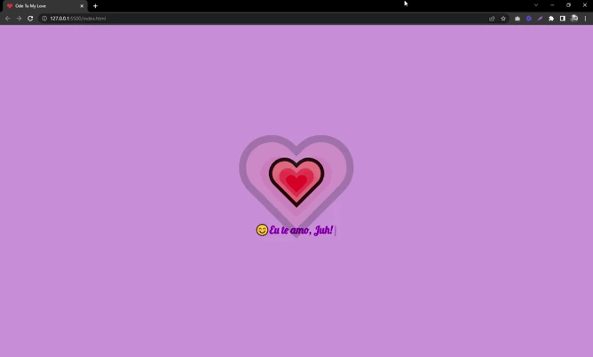

<h1 align="center">Ode To My Love</h1>

Um tributo feito para a minha amada esposa com animação em CSS e JavaScript.

  <a href="#-tecnologias">Tecnologias Usadas</a>&nbsp;&nbsp;&nbsp;|&nbsp;&nbsp;&nbsp;
  <a href="#-sobre-o-tributo">Sobre o Tributo</a>&nbsp;&nbsp;&nbsp;

 

  

## 🚀 Tecnologias

Esse tributo foi desenvolvido com as seguintes tecnologias:

- HTML e CSS
- JavaScript
- Git e Github

## 💗 Sobre o Tributo

Trata-se de uma webpage HTML com animações feitas em CSS com o auxílio do JavaScript visando mostrar um pouco do meu carinho pela minha amada esposa.